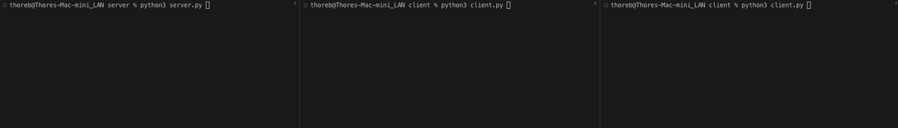

# Secure Server Client Chatroom

    

Project for the Rechnersicherheit course. The objective is to develop a server that allows clients to connect via CLI (Command Line Interface). The clients should be able to register an account, log in to their account, send private and global messages, as well as exchange files. Security is a crucial aspect of this project, ensuring the safety of both the server and the communication between clients and the server.

To achieve this, various security techniques have been employed. For instance, hashed, salted, and peppered passwords were utilized to enhance password security. Secure functions and algorithms were carefully selected and implemented, and encrypted communication channels were established. Additionally, the entire setup has been containerized using Docker, enabling platform-independent testing and deployment.

## Table Of Content

- [Course content](#course-content)
- [Grading](#grading)
- [Installation](#installation)
- [Python Setup](#python-setup)
  - [Dependencies](#dependencies)
  - [Compile and run](#compile-and-run)
- [Docker Setup](#docker-setup)
  - [Dependencies](#dependencies)
  - [Compile and run](#compile-and-run)
- [Example pictures](#example-pictures)
- [Contribution](#contribution)
- [See also](#see-also)

## Course content

The purpose of this project is to further explore and solidify the concepts learned in the Rechnersicherheit course.

## Grading

| Assignment  | Grade |
| ------------- | ------------- |
| Project  | passed  |

## Installation

 - `git clone https://github.com/thob97/Secure-Server-Client-Chatroom.git`
 - `cd Secure-Server-Client-Chatroom`
 - Next either continue with the [Docker](#docker-setup) or [Python Setup](#python-setup).

## Python Setup
### Dependencies

 * `python3`
 * `bcrypt` can be installed with `pip install bcrypt`

### Compile and run
- To compile and run the server, navigate to the server/ directory and execute the following command: 
`python3 server.py`
- Afterwards navigate to the client/ directory, now you can connect multiple clients by running the following command in a separate terminal: 
`python3 client.py`

## Docker Setup
The Docker Compose file will generate two images: one for the server and one for the client. The client image will create three client containers.

### Dependencies
 * `docker`

### Compile and run
- Build the images: `docker-compose build`
- Create the containers: `docker-compose up -d --force-recreate`
- The names of the containers are: `rechnersicherheit-projekt_server_1`, `rechnersicherheit-projekt_client_1`, `rechnersicherheit-projekt_client_2`, `rechnersicherheit-projekt_client_3`
- You can view the logs with: `docker logs <container_name>`
- And you can interact with the containers by attaching with them by executing: `docker attack <container_name>`
- Optionaly all containers and images created by docker-compose can be deleted with: `docker-compose down`

## Example pictures

    
    
    

## Contribution

* Thore Brehmer - dev project
  
## See also
* [Uni Overview](https://github.com/thob97/uni_overview.git)
